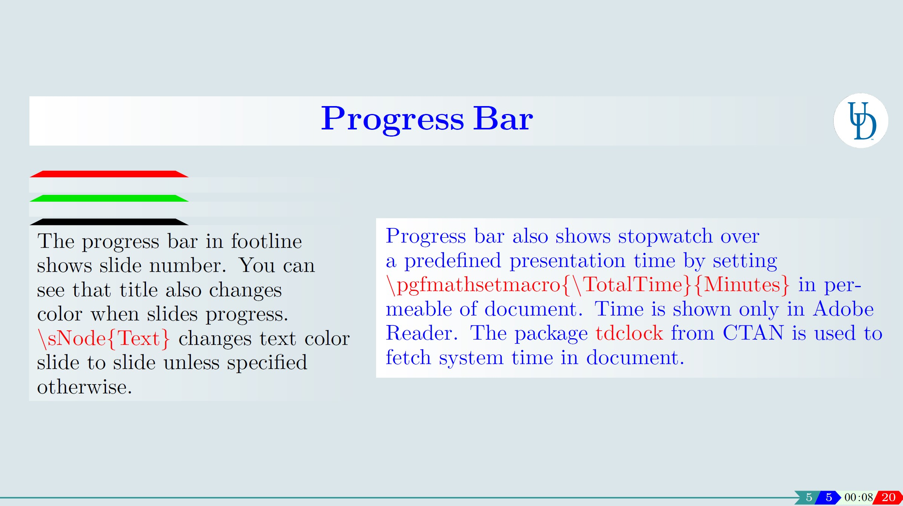
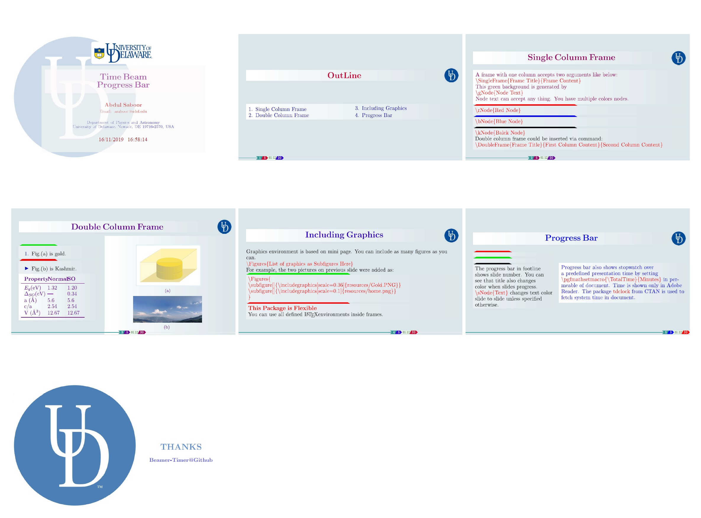

# Beamer-Timer
A Beamer Presentation with progress bar showing time. It is based on tdclock package from CTAN and personal customizations. It is available as part of the package [Vasp2Visual](https://github.com/massgh/Vasp2Visual) for DFT pre/post processing.

-----------
This repository includes a bonus Reveal-Markdown directory containing a *reveal.md* file and a theme *myserif.css*. If you have [vscode-reveal](https://marketplace.visualstudio.com/items?itemName=evilz.vscode-reveal) extension installed on [VSCode](https://code.visualstudio.com/), you can create interactive HTML presentation just using markdown and can also convert it to PDF and static HTML website like [revealjs](https://revealjs.com/).

----------
